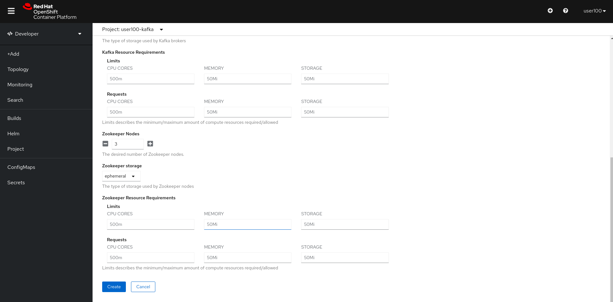
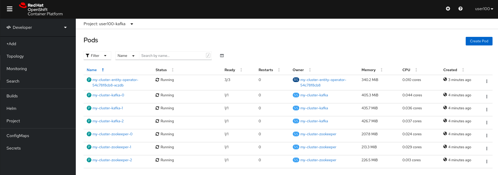
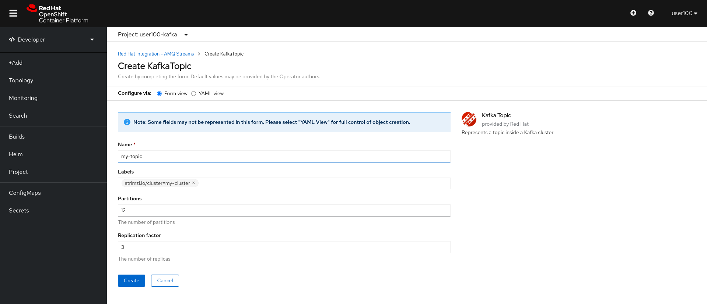
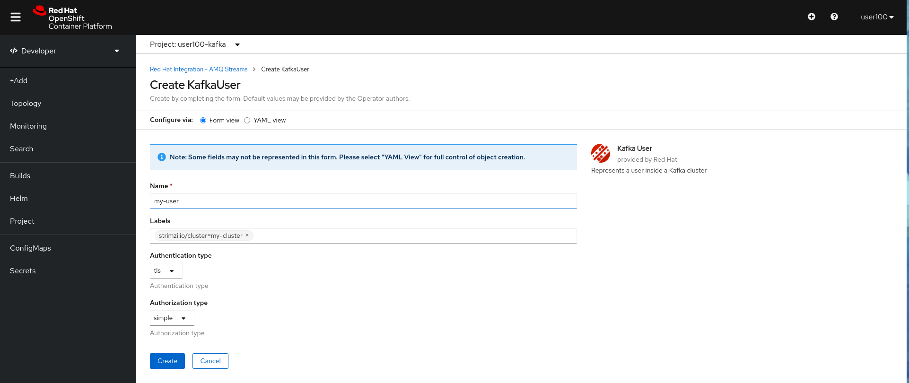
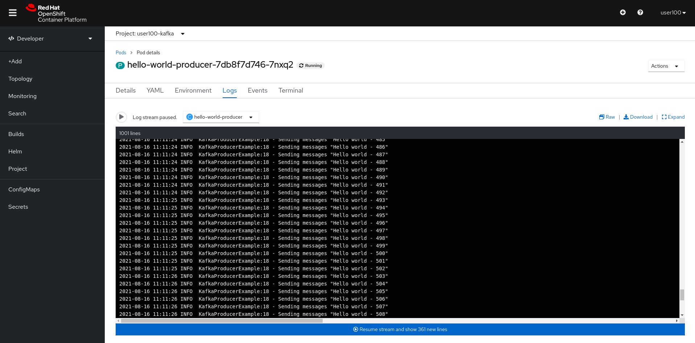
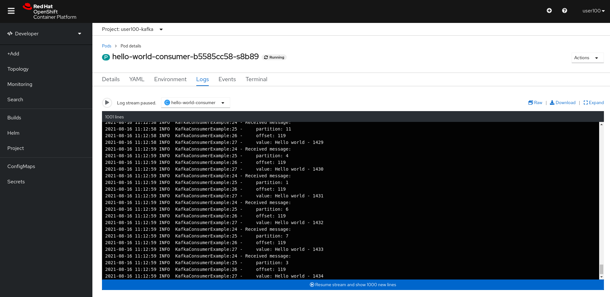

# Exercise 1 - Exploring Basic Capabillities of AMQ Streams

## Table of Contents

- [Objective](#objective)
- [Diagram](#diagram)
- [Guide](#guide)
- [Takeaways](#takeaways)

# Objective

Explore and understand the AMQ operator, In this exercise we will learn to: 
- Understand how we can ease Day1 and Day2 operations using the AMQ Streams operator
- Create our own Kafka cluster using the `Kafka` CR 
- Getting to know the different installation components 

# Diagram


Make sure you connect to the cluster before starting this exercise! 

# Guide

## Step 1

Login to the `Openshift Console` and create a project using the `Project` tab on te left. Hit the `Create a new project` button and create your own project:


## Step 2

 Click the `Add+` button in order to consume a resource from Openshift's marketplace. Pick the `Operator Backed` button in order to consume As-A-Service Kafka cluster. 

 Pick the `Kafka` resource and hit `Create` to start the deployment:  


## Step 3 

Leave the default name for your Kafka cluster and make sure you understand the wizard presented to you: 

- What does number of replicas mean?
- What is an ephemeral storage and how it connects to emptyDir?
- What are requests and limits? how do we control resources with them?

Hit the `Create` button in order to complete the installation: 




## Step 4 

Make sure your Kafka cluster was successfully installed and that you can see all of its compnents: 


## Step 5 

Veirfy that your Kafka cluster installation had been successful by using the `Project -> Pods` in the inventory: 




Here you can see that you have deployed threee things:

* Zookeeper pods - Used for holding the metadata for your Kafka cluster such as topics, users, etc.
* Kafka pods - Used for holding the logDirs, which is the actual data (sequential messages). 
* Entity Operator - Used for interacting with the Kafka cluster with things related to users, topics, etc.

## Step 6 

Ensure that the Kafka nodes are indeed using an emptyDir volumes for storing the Kafka logDirs by using `Project -> PVCs` on the left tab: 


## Step 7 

Having our Kafka cluster using emptyDirs means that on failure that Kafka cluster will have to replicate data on his own because **the underlying volume is gone**.
In this case we will count on Kafka's replication mechanism for replicating the data which can sometimes cause unwanted latency. 

To do so, we'll create a producer a Topic, a Producer and a Consumer that will send messages to one another. Producer --> Topic --> Consumer. 


We'll kill one of the Kafka nodes and see how it affects the offset being transfered between the producer and the consumer. 


## Step 8 

Let's create a Kafka topic using the `Add+ -> Operator Backed -> Kafka Topic -> Create` with the name `my-topic`: 




Make sure you leave the default values and hit the `Create` button. 

### Pause To Think
*Question - How does the Kafka Topic know which cluster to point to?*

## Step 9 

Validate that the created Kafka topic was created successfuly by using `get kt` command: 

```bash 
$ oc get kt
                                                                                
NAME       PARTITIONS   REPLICATION FACTOR
my-topic   10           3
```

The Kafka topic was created with 10 parititions and replication factor of 3. 

### Pause to Think  

*How will the paritions be divided across our Kafka nodes? How many parititions will every node get?*


## Step 10 

Let's create a Kafka user to interact with the created topic, move through the `KafkaUser` CR to verify that you understand how user management is handled in AMQ.

Copy this YAML, and paste it in `Add+ -> Operator Backed -> Kafka User` in order to create the `Kafka User` CR: 
 



Before you hit the `Create` button, switch to the `YAML View` section to verify you understand all the ACLs that is being given to our created user.

## Step 11

Now let's create a Kafka Producer that will write messages to our `my-topic` topic, and a consumer that will consume those messages via `Add+ -> YAML` 

```bash 
apiVersion: apps/v1
kind: Deployment
metadata:
  labels:
    app: hello-world-producer
  name: hello-world-producer
spec:
  replicas: 1
  selector:
    matchLabels:
      app: hello-world-producer
  template:
    metadata:
      labels:
        app: hello-world-producer
    spec:
      containers:
      - name: hello-world-producer
        image: strimzici/hello-world-producer:support-training
        env:
          - name: CA_CRT
            valueFrom:
              secretKeyRef:
                name: my-cluster-cluster-ca-cert
                key: ca.crt
          - name: USER_CRT
            valueFrom:
              secretKeyRef:
                name: my-user
                key: user.crt
          - name: USER_KEY
            valueFrom:
              secretKeyRef:
                name: my-user
                key: user.key
          - name: BOOTSTRAP_SERVERS
            value: my-cluster-kafka-bootstrap:9093
          - name: TOPIC
            value: my-topic
          - name: DELAY_MS
            value: "100"
          - name: LOG_LEVEL
            value: "INFO"
          - name: MESSAGE_COUNT
            value: "5000"
```
Now let's create a Kafka consumer that will read messages from our `my-topic` topic via `Add+ -> YAML` :

```
apiVersion: apps/v1
kind: Deployment
metadata:
  labels:
    app: hello-world-consumer
  name: hello-world-consumer
spec:
  replicas: 1
  selector:
    matchLabels:
      app: hello-world-consumer
  template:
    metadata:
      labels:
        app: hello-world-consumer
    spec:
      containers:
      - name: hello-world-consumer
        image: strimzici/hello-world-consumer:support-training
        env:
          - name: CA_CRT
            valueFrom:
              secretKeyRef:
                name: my-cluster-cluster-ca-cert
                key: ca.crt
          - name: USER_CRT
            valueFrom:
              secretKeyRef:
                name: my-user
                key: user.crt
          - name: USER_KEY
            valueFrom:
              secretKeyRef:
                name: my-user
                key: user.key
          - name: BOOTSTRAP_SERVERS
            value: my-cluster-kafka-bootstrap:9093
          - name: TOPIC
            value: my-topic
          - name: GROUP_ID
            value: my-group
          - name: LOG_LEVEL
            value: "INFO"
          - name: MESSAGE_COUNT
            value: "1000"
```

## Step 13 

Verify that both consumer and producer works as expected by browsing their logs with `Topology -> hello-producer/consumer -> Resources - View Logs`, for example: 

### Producer Logs


### Consumer Logs




## Step 14 

Now after that we have our producer and consumer running as expected, open another Let's try to delete one of our Kafka pods and see what happens.

From the `Topology -> my-cluster-kafka -> Resources`, Click on one of the pods and hit `Actions -> Delete Pod`: 


Go back to you cosumer logs and verify that you have lost connection the the Kafka node: 


The failure happened because we have accessed a node that had no healthy replica of the data we've asked for. Replicating the data when using large scale can be very painful, In the next exercise we will see how we can use OCS RBD to save the persistency of our data so that each Kafka node that is being deleted will get the same PV.

## Step 15 

Delete the exercise's resources using:
*  `Topology -> hello-producer -> Delete Deployment`
*  `Topology -> hello-consumer -> Delete Deployment`
*  `Search -> Resources -> KafkaUser -> Delete`
*  `Search -> Resources -> Kafka -> Delete`

Make sure you have nothing in the `Topology View`.
# Complete

Congratulations! You have completed the first exercise :)

---
[Click Here to return to the AMQ streams Workshop](../README.md)
